# [**Airflow Project: ETL and ELT**](https://github.com/ArrayPD/Airflow-ETL-ELT/blob/main/README.md)

**Goals of this project**:
1. ETL and ELT automation with Airflow.
2. Demonstrate ML application's value in real world jobs.
3. Interpret plain data by intuitive chart or dashboard.

## [**Table of Contents**](#Airflow-Project:-ETL-and-ELT)
* [Design](#Design)
  * [ETL DAG](#ETL-DAG)
  * [ELT DAG](#ELT-DAG)
  * [Merge DAGs](#Merge-DAGs)
  * [Further task with Metabase](#Further-task-with-Metabase)
  * [Chart pipeline](#Chart-pipeline)
* [Setup](#Setup)
  * [Requirements](#Requirements)
  * [Run the DAGs](#Run-the-DAGs)
* [Project Structure](#Project-Structure)
* [Summary](#Summary)

## [**Design**](#Table-of-Contents)

In this project, we use Airflow to orchestrate three fully functional pipelines.
They are:
* ETL pipeline
* ELT pipeline
* Chart pipeline

We also build miscellaneous functions as downstream tasks of ETL/ELT pipeline.
These functions cover 3 topics: ML model training, data visualization and
printing format table. Meanwhile add Metabase case, as an extensoin of ELT and
enhancement of data visualization.

### [**ETL DAG**](#Table-of-Contents)

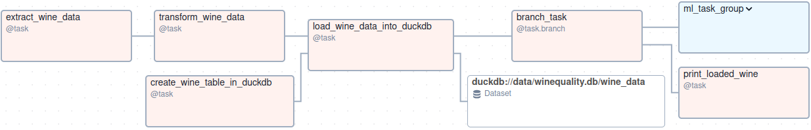

The **ETL pipeline** will:
1. Extract data from local csv file into a Pandas DataFrame.
2. Transform the Pandas DataFrame.
3. Load transformed Pandas DataFrame into a DuckDB.

ETL pipeline followed by a branch task. The branch task decides which downstream
task will be triggered.
* One possible choice is ML task group, including data preprocess task, choose
  model task and model training task. The trained model could predict alcohol
  index of wine according to residual sugar, pH and other chemical or physical
  indices.

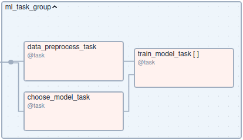

* The other choice is a report task, named "print_loaded_wine". It will print
  out basic statistics info of alcohol of different qualities in logs.

### [**ELT DAG**](#Table-of-Contents)

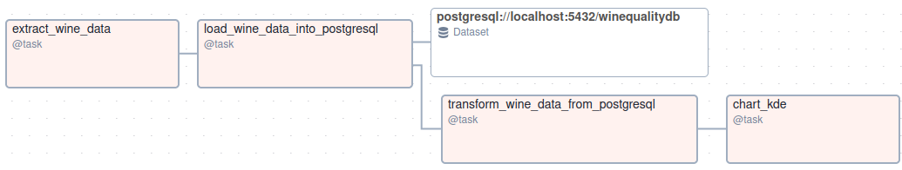

The **ELT pipeline** will:
1. Extract data from local csv file into a Pandas DataFrame.(Share data with
   ETL pipeline)
2. Load the Pandas DataFrame into a PostgreSQL.
3. Transform the data from PostgreSQL.

ELT pipeline followed by "chart_kde" task. This task calculates the
"kernel density estimate (KDE)" of alcohol of different qualities, with ELT's
output, and draws a picture of the result, named "alcohol_kde.pdf".

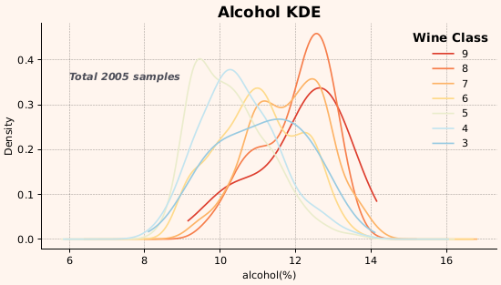

### [**Merge DAGs**](#Table-of-Contents)

To have a big picture we merge above tasks into one DAG and name it as
"ETL_ELT_wine".

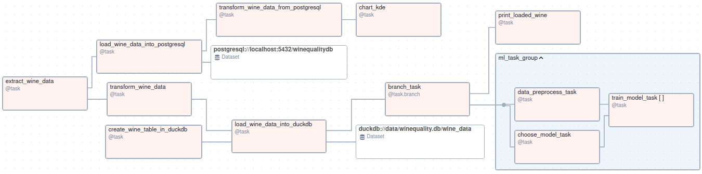

### [**Further task with Metabase**](#Table-of-Contents)

**`Metabase`** accesses the PostgreSQL as data source, for further data
analysis or BI jobs. For example, we visualise wine quality distribution by
following steps.

**Steps**:
1. Add `winequalitydb` as Metabase data source.
2. Select `winequalitydb` from Databases.
3. Click on `Wine Data` to view table contents.

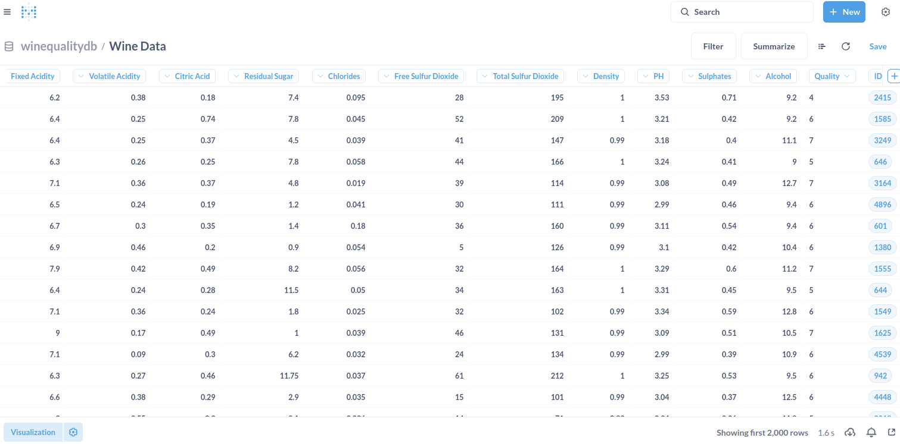

4. Select `>_ SQL query` from `+ New` drop list at the top right of screen.
5. Confirm or set `winequalitydb` as selected database, from the left side
   of screen.
6. Put following sql in editor.
```sql
SELECT
    quality,
    COUNT(*) AS "count"
FROM
    wine_data
GROUP BY
    quality
ORDER BY
    quality ASC
```
7. Click on `Run query` or press shortcut `Ctrl + enter`.
8. Click on `Visualization` at the bottom left of screen.
9. Double click `Bar` icon.
10. Set `Bar options`.
  * X-axis: **quality**, Add **Class** as prefix.
  * Y-axis: **Count**
11. Click `Done` at bottom.

Then save this as a new question and add it into a dashboard. By similarly steps,
create a Pie chart and add it into the same dashboard.

The results look like:

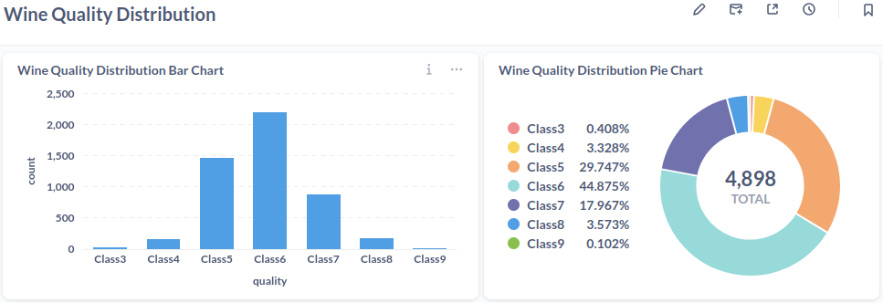

### [**Chart pipeline**](#Table-of-Contents)

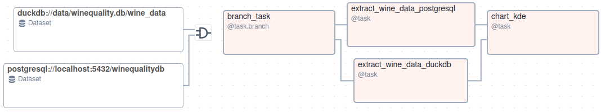

The **chart pipeline** will:
1. Decide which task will be triggered by branch task.
2. Extract data from PostgreSQL or DuckDB according to the branch task's return.
3. Draw a chart with extracted data.

This pipeline is a specific case for Airflow Datasets feature. It will be
automatically triggered, after dependent datasets updated. To emphasize the
relation between this pipeline and former ETL and ELT pipelines, we named it as
"ETL_ELT_wine_downstream".

A success "ETL_ELT_wine_downstream" run will create a chart like:

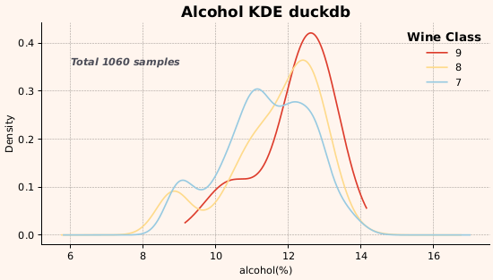

## [Setup](#Table-of-Contents)

### [Requirements](#Table-of-Contents)
This project stands on the shoulders of giants:
* Airflow
* pandas
* numpy
* scikit-learn
* mlflow
* duckdb
* postgresql
* adbc-driver-postgresql
* Metabase
* matplotlib

> **Note**
> Create a PostgreSQL database named `winequalitydb`, and set URI according
> to real configuration, before run the DAGs.

### [Run the DAGs](#Table-of-Contents)

Start MLflow Tracking Server by command.
```shell
mlflow server --host 127.0.0.1 --port 5000
```
Then access MLflow UI at `localhost:5000`.

Start Airflow by command.
```shell
airflow standalone
```
After Airflow has started. Access the Airflow UI at `localhost:8080`.
Filter DAGs by tag `wine_quality`.

* **Trigger DAGs by Airflow UI**:

  Manually trigger `ETL_ELT_wine` DAG by clicking on the `Trigger DAG`
  button on the right side of the DAG. Then confirm or set
  `high_quality_threshold` and `ml_sample_count_threshold` value.
  Next click on `Trigger` button at the bottom left of the window.

  `ETL_ELT_wine_downstream` DAG will be automatically triggered after
  `ETL_ELT_wine` DAG updated datasets.

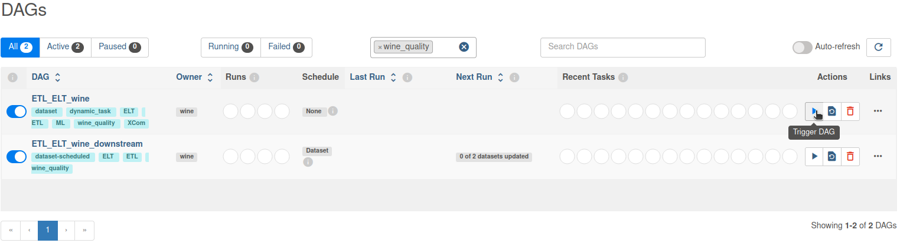


* **Trigger DAGs by Airflow cli**:

  Run the following command from terminal.

  `airflow dags trigger ETL_ELT_wine`

Observe the DAGs run according to the dependencies which have been set by
Datasets feature. Following screenshots clearly indicate the relationship
between the 2 DAGs.

**ETL_ELT_wine** is running.

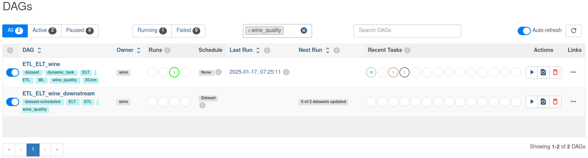

**ETL_ELT_wine_downstream** is triggered.

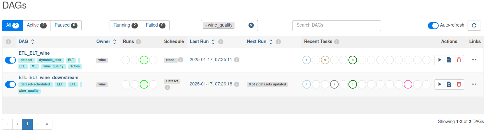

**ETL_ELT_wine_downstream** finished. **ETL_ELT_wine** is still running.

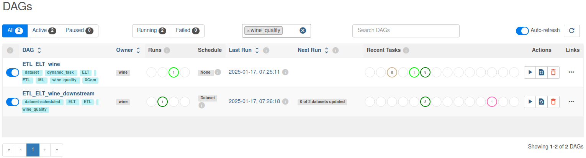

**ETL_ELT_wine** finished.

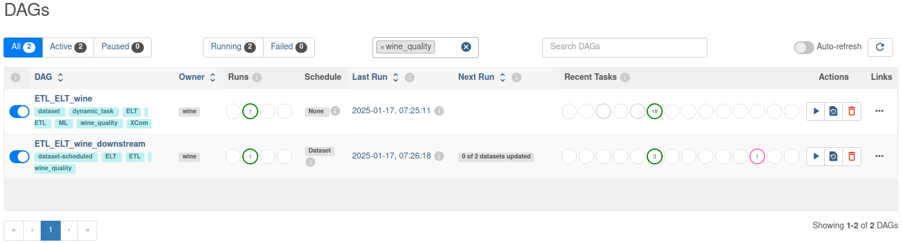

A success ETL_ELT_wine DAG run looks like:

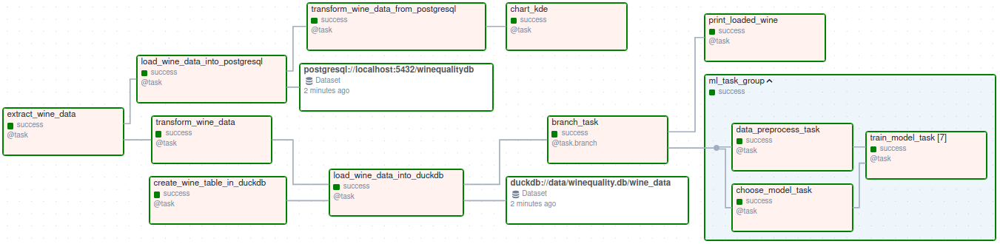

A success ETL_ELT_wine_downstream DAG run looks like:

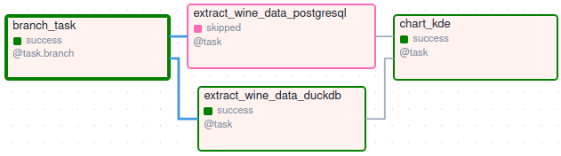

MLflow as a part of ETL_ELT_wine DAG run, looks like:

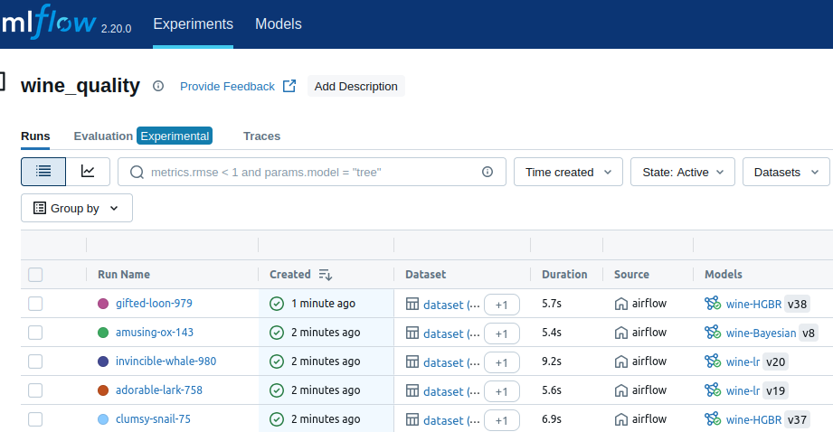

## [Project Structure](#Table-of-Contents)

This project contains the following files and folders:
* `dags`:
  * `etl_elt_wine.py`: a DAG performing ETL and ELT.
  * `etl_elt_wine_downstream.py`: a DAG to draw chart report.
  * `include`:
    * `utils.py`: contains utility functions to support ETL, ELT, ML and other jobs.
* `data`:
  * `winequality-white.csv`: source data.
* `images`: contains a series of images used in README.
* `requirements.txt`: required python packages.
* `README.md`: this Readme.

## [Summary](#Table-of-Contents)

* This project implements ETL, ELT and downstream tasks with Airflow. Deals with
  pratical problems, by applying XCom, datasets and dynamic task mapping features
  of Airflow. Both DAGs are writen in TaskFlow form rather than traditional
  operator form.

* Highlights potential value of integrating ML application into real world jobs.

* Demonstrates how to use Metabase for data analysis and visualization.
